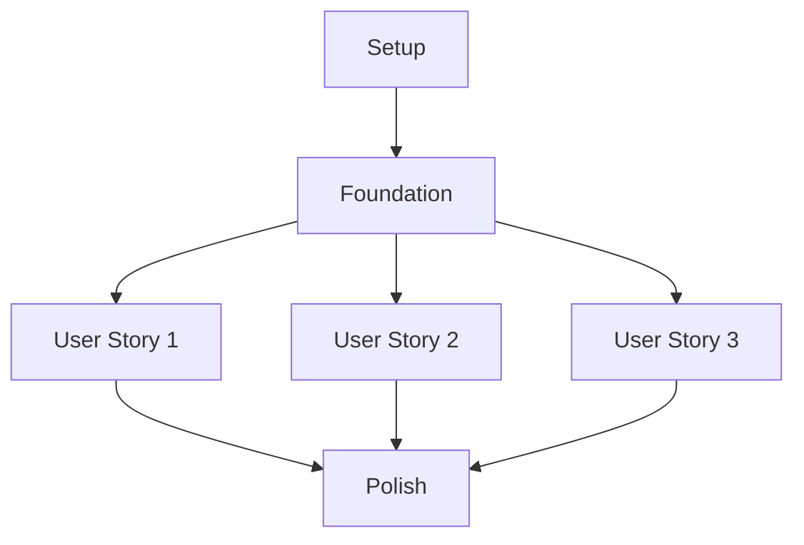

# Implementation Tasks: Logic Grid Puzzle Solver

## Implementation Strategy

- Focus on User Story 1 (MVP): Load puzzle → mark cells → save state
- Each user story is independently testable
- Follow test-first development per constitution
- Modular architecture enables parallel development
- Early scaffolding of core puzzle engine

## Task Dependencies

## Phase 1: Project Setup

Basic project structure and development environment:

- [ ] T001 Create backend project structure per implementation plan
- [ ] T002 Initialize Node.js project in backend directory
- [ ] T003 Create frontend project structure per implementation plan
- [ ] T004 Create storage directories for puzzles
- [ ] T005 [P] Add ESLint configuration for backend
- [ ] T006 [P] Add Prettier configuration for consistent formatting
- [ ] T007 [P] Configure Jest for backend testing
- [ ] T008 [P] Configure JSDOM for frontend testing
- [ ] T009 Create initial README.md with setup instructions
- [ ] T010 Add .gitignore for Node.js project

## Phase 2: Foundation

Core functionality required by all user stories:

- [ ] T011 Create basic Express.js server setup in backend/src/server.js
- [ ] T012 Implement file system utility in backend/src/services/storage.js
- [ ] T013 Create puzzle model in backend/src/models/puzzle.js
- [ ] T014 Create grid model in backend/src/models/grid.js
- [ ] T015 [P] Create API client in frontend/src/services/api.js
- [ ] T016 [P] Create state management in frontend/src/services/state.js
- [ ] T017 Create basic HTML structure in frontend/src/index.html
- [ ] T018 Add core CSS styles in frontend/src/styles/main.css
- [ ] T019 Create sample puzzle file in puzzles/samples/sample.json
- [ ] T020 Implement error handling middleware in backend/src/middleware/error.js

## Phase 3: Load and Interact with Puzzle (User Story 1)

MVP functionality for loading and interacting with puzzles:

- [ ] T021 [US1] Create contract test for puzzle loading API
- [ ] T022 [US1] Implement GET /puzzles/{id} endpoint in backend/src/api/routes/puzzles.js
- [ ] T023 [P] [US1] Create Grid component in frontend/src/components/grid.js
- [ ] T024 [US1] Implement grid cell marking logic in backend/src/services/solver.js
- [ ] T025 [US1] Create contract test for cell marking API
- [ ] T026 [US1] Implement POST /puzzles/{id}/marks endpoint
- [ ] T027 [P] [US1] Add grid interaction handlers in frontend/src/components/grid.js
- [ ] T028 [US1] Implement symmetric relationship enforcement in backend/src/services/solver.js
- [ ] T029 [US1] Create contract test for state saving API
- [ ] T030 [US1] Implement POST /puzzles/{id}/save endpoint
- [ ] T031 [P] [US1] Add save/load UI controls in frontend/src/components/toolbar.js
- [ ] T032 [US1] Implement integration test for full solving workflow

## Phase 4: Create New Puzzles (User Story 2)

Enable puzzle creation and editing:

- [ ] T033 [US2] Create contract test for puzzle creation API
- [ ] T034 [US2] Implement POST /puzzles endpoint
- [ ] T035 [P] [US2] Create PuzzleEditor component in frontend/src/components/editor.js
- [ ] T036 [US2] Implement puzzle validation in backend/src/services/validator.js
- [ ] T037 [US2] Create contract test for puzzle update API
- [ ] T038 [US2] Implement PUT /puzzles/{id} endpoint
- [ ] T039 [P] [US2] Add category editor UI in frontend/src/components/category-editor.js
- [ ] T040 [P] [US2] Add clue editor UI in frontend/src/components/clue-editor.js
- [ ] T041 [US2] Implement clue validation in backend/src/services/validator.js
- [ ] T042 [US2] Add integration test for puzzle creation workflow

## Phase 5: Basic Deduction Assistance (User Story 3)

Implement automated deduction features:

- [ ] T043 [US3] Implement constraint engine in backend/src/services/solver.js
- [ ] T044 [US3] Create deduction rules system in backend/src/services/rules.js
- [ ] T045 [US3] Add automated marking logic to POST /puzzles/{id}/marks endpoint
- [ ] T046 [P] [US3] Create DeductionPanel component in frontend/src/components/deduction-panel.js
- [ ] T047 [US3] Implement basic deduction strategies in backend/src/services/strategies.js
- [ ] T048 [P] [US3] Add visual feedback for automated deductions in frontend/src/components/grid.js
- [ ] T049 [US3] Create integration test for automated deduction workflow

## Phase 6: Polish & Cross-Cutting Concerns

Final improvements and optimizations:

- [ ] T050 [P] Add loading indicators to frontend components
- [ ] T051 [P] Implement error toast notifications
- [ ] T052 Add comprehensive API documentation
- [ ] T053 Optimize grid rendering performance
- [ ] T054 Add keyboard shortcuts for common actions
- [ ] T055 Implement undo/redo functionality
- [ ] T056 Add progressive web app support
- [ ] T057 Create production build pipeline
- [ ] T058 Add automated browser testing
- [ ] T059 Create deployment documentation
- [ ] T060 Perform security audit and fixes

## Parallel Execution Examples

### User Story 1 Parallel Tracks:
1. Backend Track:
   - T022 → T024 → T026 → T028 → T030
2. Frontend Track:
   - T023 → T027 → T031
3. Test Track:
   - T021 → T025 → T029 → T032

### User Story 2 Parallel Tracks:
1. Backend Track:
   - T034 → T036 → T038 → T041
2. Frontend Track:
   - T035 → T039 → T040
3. Test Track:
   - T033 → T037 → T042

### User Story 3 Parallel Tracks:
1. Backend Track:
   - T043 → T044 → T045 → T047
2. Frontend Track:
   - T046 → T048
3. Test Track:
   - T049

## Task Summary

- Total Tasks: 60
- Tasks per Story:
  - User Story 1 (MVP): 12 tasks
  - User Story 2: 10 tasks
  - User Story 3: 7 tasks
  - Setup: 10 tasks
  - Foundation: 10 tasks
  - Polish: 11 tasks
- Parallel Opportunities: 19 tasks marked with [P]
- Independent Test Criteria:
  - US1: Load puzzle → mark cell → verify symmetric changes → save/reload
  - US2: Create puzzle → add categories/clues → save → load for solving
  - US3: Mark cell → observe automatic deductions → verify logical consistency

## MVP Scope

User Story 1 (T021-T032) represents the MVP, delivering:
- Puzzle loading and display
- Basic grid interaction
- Symmetric relationship enforcement
- State persistence

This provides a fully functional puzzle solver with manual solving capabilities.